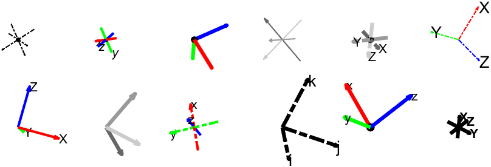

# *plotframe*: Plot a 3-D Cartesian coordinate system

### Syntax

- `plotframe( )`
- `plotframe( rotationMatrix, translationVector )`
- `plotframe( rotationMatrix, translationVector, basisVectorLengths )`
- `plotframe( __ , Parent=ax )`
- `plotframe( __ , Name=Value )`
- `hg = plotframe( __ )`

### Inputs

| Positional Argument | Description |
| --- | --- |
| `rotationMatrix` | Defines the orientation of the coordinate frame, from the origin. 3-by-3 orthogonal matrix. Default is zero rotation, i.e., `eye(3)`. |
| `translationVector` | Defines the position of coordinate frame, from the origin. 1-by-3 or 3-by-1 numeric vector. Default is `[0 0 0]`. |
| `basisVectorLengths` | Length to plot each arrow (basis) of the coordinate frame. Scalar, 1-by-3, or 3-by-1 numeric vector. Default is `1`. |

| Name-Value Argument | Description |
| --- | --- |
| `Parent` | Axes in which to plot. Scalar axes, group (`hggroup`), or transform (`hgtransform`) object. Default is the current axes (`gca`). |
| `UpdateFrame` | With `UpdateFrame`, the passed plot handles will be updated with the current parameters, rather than creating a new plot. This is more efficient and convenient for moving frames. Handle to an existing frame plot, outputted from a previous call to `plotframe`. |
| `MatrixIndexing` | Depending on notation, either the columns or the rows of `rotationMatrix` define the orientation of the basis vectors. Text scalar, either `"columnmajor"` or `"rowmajor"`. Default is row-major. |
| `LabelBasis` | Whether the bases should be labelled, e.g., `"X"`, `"Y"`, and `"Z"`. Scalar logical. Default is `false`. |
| `Labels` | Text with which to label each basis, if `LabelBasis` is enabled. Scalar, 1-by-3, or 3-by-1 text vector. Default is `{'X','Y','Z'}`. |
| `BasisColors` | Color for each basis vector. Any color format accepted by MATLAB can be used, e.g., RGB triplet `[0 0 0]`, hexadecimal color code `#000000`, or color name `'black'` or `'k'`. Specify multiple colors with an M-by-3 matrix where each RGB color is a row, or as a 1-by-3 or 3-by-1 text array. Default is `{'r','g','b'}`. |
| `TextProperties` | Custom properties for the basis labels. Name-value arguments stored in a cell array of alternating text property names and values, e.g., `{'FontSize',20,'FontWeight','bold'}`. |
| `QuiverProperties` | Additional name-value arguments are passed as properties of the Quiver charts used to plot the basis vectors, e.g., `plotframe( LineStyle="-.", Marker="o" )`. |

### Output

| Argument | Description |
| --- | --- |
| `hg` | Group object (`hggroup`) containing handles to the constituent parts of the coordinate frame plot, i.e., the 3 `Quiver` and optional `Text` objects. |

### Examples

Please see [*examples.mlx*](examples.mlx) or [*examples.pdf*](examples.pdf).

## Compatibility, License and Citation

Created in 2022b. Compatible with MATLAB release 2020b and later. Compatible with all platforms.

Published under MIT License (see [*LICENSE.txt*](LICENSE.txt)).

Please cite George Abrahams (https://github.com/WD40andTape/plotframe, https://www.linkedin.com/in/georgeabrahams).
